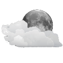

OxygenWeatherIcons
====================================

OxygenWeatherIcons contains all weather icons from the [Oxygen team](http://www.oxygen-icons.org/). I don't own any rights of these icons. They're licensed under KDE; / LGPL (https://www.gnu.org/copyleft/lgpl.html) by **The Oxygen Team**.

# Mapping of the icons to the [OpenWeatherMap](https://openweathermap.org/weather-conditions) statuses

|OpenWeatherMap-Id|Icon|Link|Description|
|-|-|-|-|
|`200, 201, 202, 210, 211, 212, 221, 230, 231, 232`||[Link](https://commons.wikimedia.org/wiki/File:Oxygen480-status-weather-storm-day.svg)|Thunderstorm day|
|`200, 201, 202, 210, 211, 212, 221, 230, 231, 232`||[Link](https://commons.wikimedia.org/wiki/File:Oxygen480-status-weather-storm-night.svg)|Thunderstorm night|
|`300, 301, 302, 310, 311, 312, 313, 314, 321, 520, 521, 522, 531`||[Link](https://commons.wikimedia.org/wiki/File:Oxygen480-status-weather-showers-day.svg)|Shower rain day|
|`300, 301, 302, 310, 311, 312, 313, 314, 321, 520, 521, 522, 531`||[Link](https://commons.wikimedia.org/wiki/File:Oxygen480-status-weather-showers-night.svg)|Shower rain night|
|`500, 501, 502, 503, 504`||[Link](https://commons.wikimedia.org/wiki/File:Oxygen480-status-weather-showers-scattered-day.svg)|Rain day|
|`500, 501, 502, 503, 504`||[Link](https://commons.wikimedia.org/wiki/File:Oxygen480-status-weather-showers-scattered-night.svg)|Rain night|
|`511`||[Link](https://commons.wikimedia.org/wiki/File:Oxygen15.04.1-weather-freezing-rain.svg)|Freezing rain|
|`600, 601, 602, 620, 621, 622`||[Link](https://commons.wikimedia.org/wiki/File:Oxygen480-status-weather-snow-scattered-day.svg)|Snow day|
|`600, 601, 602, 620, 621, 622`||[Link](https://commons.wikimedia.org/wiki/File:Oxygen480-status-weather-snow-scattered-night.svg)|Snow night|
|`611, 612, 613, 615, 616`||[Link](https://commons.wikimedia.org/wiki/File:Oxygen480-status-weather-snow-rain.svg)|Snow rain|
|`701, 711, 721, 731, 741, 751, 761, 762, 771, 781`||[Link](https://commons.wikimedia.org/wiki/File:Oxygen480-status-weather-mist.svg)|Mist|
|`800`||[Link](https://commons.wikimedia.org/wiki/File:Oxygen480-status-weather-clear.svg)|Clear sky day|
|`800`||[Link](https://commons.wikimedia.org/wiki/File:Oxygen480-status-weather-clear-night.svg)|Clear sky night|
|`801`||[Link](https://commons.wikimedia.org/wiki/File:Oxygen480-status-weather-few-clouds.svg)|Few clouds day|
|`801`||[Link](https://commons.wikimedia.org/wiki/File:Oxygen480-status-weather-few-clouds-night.svg)|Few clouds night|
|`802`||[Link](https://commons.wikimedia.org/wiki/File:Oxygen480-status-weather-clouds.svg)|Scattered clouds day|
|`802`||[Link](https://commons.wikimedia.org/wiki/File:Oxygen480-status-weather-clouds-night.svg)|Scattered clouds night|
|`803, 804`||[Link](https://commons.wikimedia.org/wiki/File:Oxygen480-status-weather-many-clouds.svg)|Broken clouds day|
|`803, 804`||[Link](https://commons.wikimedia.org/wiki/File:Oxygen480-status-weather-many-clouds.svg)|Broken clouds night|
|`default`||[Link](https://commons.wikimedia.org/wiki/File:Oxygen480-status-weather-none-available.svg)|None available|

# Source files

* https://commons.wikimedia.org/wiki/File:Oxygen15.04.1-weather-freezing-rain.svg
* https://commons.wikimedia.org/wiki/File:Oxygen480-status-weather-clear.svg
* https://commons.wikimedia.org/wiki/File:Oxygen480-status-weather-clear-night.svg
* https://commons.wikimedia.org/wiki/File:Oxygen480-status-weather-clear-night_Workaround.svg
* https://commons.wikimedia.org/wiki/File:Oxygen480-status-weather-clouds.svg
* https://commons.wikimedia.org/wiki/File:Oxygen480-status-weather-clouds-night.svg
* https://commons.wikimedia.org/wiki/File:Oxygen480-status-weather-few-clouds.svg
* https://commons.wikimedia.org/wiki/File:Oxygen480-status-weather-few-clouds-night.svg
* https://commons.wikimedia.org/wiki/File:Oxygen480-status-weather-hail.svg
* https://commons.wikimedia.org/wiki/File:Oxygen480-status-weather-many-clouds.svg
* https://commons.wikimedia.org/wiki/File:Oxygen480-status-weather-mist.svg
* https://commons.wikimedia.org/wiki/File:Oxygen480-status-weather-none-available.svg
* https://commons.wikimedia.org/wiki/File:Oxygen480-status-weather-showers.svg
* https://commons.wikimedia.org/wiki/File:Oxygen480-status-weather-showers-day.svg
* https://commons.wikimedia.org/wiki/File:Oxygen480-status-weather-showers-night.svg
* https://commons.wikimedia.org/wiki/File:Oxygen480-status-weather-showers-scattered.svg
* https://commons.wikimedia.org/wiki/File:Oxygen480-status-weather-showers-scattered-day.svg
* https://commons.wikimedia.org/wiki/File:Oxygen480-status-weather-showers-scattered-night.svg
* https://commons.wikimedia.org/wiki/File:Oxygen480-status-weather-snow.svg
* https://commons.wikimedia.org/wiki/File:Oxygen480-status-weather-snow-rain.svg
* https://commons.wikimedia.org/wiki/File:Oxygen480-status-weather-snow-scattered.svg
* https://commons.wikimedia.org/wiki/File:Oxygen480-status-weather-snow-scattered-day.svg
* https://commons.wikimedia.org/wiki/File:Oxygen480-status-weather-snow-scattered-night.svg
* https://commons.wikimedia.org/wiki/File:Oxygen480-status-weather-storm.svg
* https://commons.wikimedia.org/wiki/File:Oxygen480-status-weather-storm-day.svg
* https://commons.wikimedia.org/wiki/File:Oxygen480-status-weather-storm-night.svg

# License

* The Oxygen Team, KDE; / LGPL (https://www.gnu.org/copyleft/lgpl.html)

Change history
--------------

See the [Changelog](https://github.com/SeppPenner/OxygenWeatherIcons/blob/master/Changelog.md).
